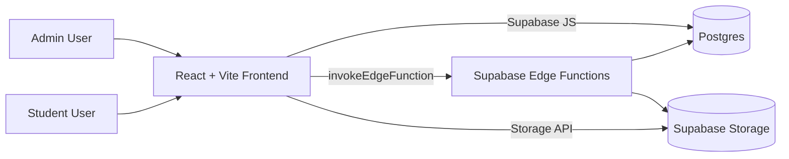

# GMBD MBB Lab Inventory: Overview
[Back to README](../README.md) | [Next: Features](./01-Features.md)

## Project Description
GMBD MBB Lab Inventory is a web-based laboratory inventory system for managing **Chemicals** and **Consumables**. It centralises stock records, usage transactions, storage location data, and audit-ready logs in one platform for the GMBD MBB laboratory context.

The system is designed for two major operating modes: **Admin mode** (full inventory management) and **Student mode** (PIN-gated, limited item usage recording). It uses Supabase for authentication, database, Row Level Security (RLS), and edge functions.

## Problem Statement
Manual tracking of laboratory supplies often causes delayed updates, unclear stock status, and incomplete usage records. This leads to stock-outs, over-ordering, and weak traceability during audits.

## Objectives
- Provide real-time inventory visibility for chemicals and consumables.
- Enforce role-based access for administrative and student workflows.
- Standardise usage, restock, adjust, archive, and dispose transactions.
- Preserve historical logs for operations and reporting.
- Support compliance-oriented documentation such as MSDS version history.

## Tech Stack
| Layer | Technology | Notes |
|---|---|---|
| Frontend | React 18 + Vite 6 | SPA with React Router |
| UI | Tailwind CSS + Radix UI + Lucide | Component-driven UI |
| Data/Backend | Supabase (Postgres + REST/RPC + Storage) | Main backend platform |
| Auth | Supabase Auth | Email/password + invite/set-password flow |
| Security | Supabase RLS + Storage Policies + Edge Functions | Role and PIN enforcement |
| Charts/Reports | Recharts | Dashboard/report visuals |
| Hosting | Vercel-ready config (`vercel.json`) | SPA rewrite to `/` |

## Main Modules / Screens
Based on `src/pages.config.js` and `src/pages/*`:
- Login
- Set Password
- Dashboard
- Chemicals
- Consumables
- Usage Logs
- Reports
- Settings
- Admin Management (visible for `super_admin`)
- Student Use
- About

## High-Level Diagram

