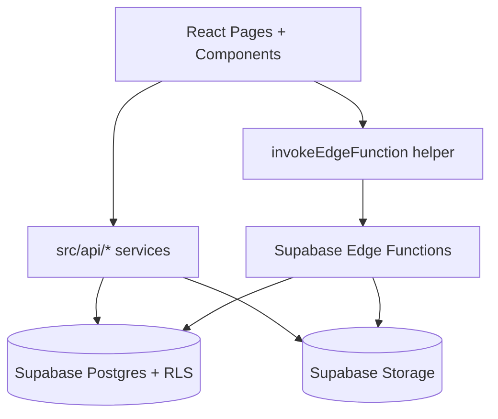

# Architecture
[Back: System Flow](./03-System-Flow.md) | [Next: Database Schema](./05-Database-Schema.md)

## Folder Structure (Key Parts)
```text
src/
  api/                 # Data access service modules
  components/          # UI and feature components
    inventory/         # Inventory-specific components/dialogs
    ui/                # Reusable UI primitives
  hooks/               # Custom hooks (e.g., debounce)
  lib/                 # Auth context, Supabase client, edge client
  pages/               # Route-level pages/screens
  types/               # Type definitions (e.g., MSDS)
  App.jsx              # Router + providers
  Layout.jsx           # Protected app shell + nav

supabase/
  migrations/          # SQL migrations (schema, RLS, policies, functions)
  functions/           # Edge functions (Deno)
```

## Application Pattern
- React SPA using route-per-page pattern (`pages.config.js` + `App.jsx`).
- Feature modules live under `components/inventory` and `src/api`.
- Supabase is used directly in frontend data clients and via edge functions for sensitive flows.

## State Management
- Primary state management: `useState`, `useEffect`, `useMemo`, `useCallback`.
- Global auth state: `AuthContext`.
- React Query provider exists (`QueryClientProvider`), but most feature pages use direct state + manual fetch patterns.

## Data Fetching Pattern
- Frontend data clients:
  - `itemsDataClient.js`
  - `usageLogsDataClient.js`
  - `profilesDataClient.js`
  - `msdsService.ts`
- Sensitive/public operations via edge functions using `invokeEdgeFunction`.
- Sorting/filtering mostly client-side after fetch.

## Error Handling and Logging
- UI notifications through `sonner` toasts.
- `try/catch` in page handlers and service calls.
- Console logging for developer diagnostics in frontend and edge functions.
- Edge functions return structured HTTP errors with JSON payloads.

## Performance and UX Optimisations Observed
- Debounced search (`useDebounce`, lodash debounce in student mode).
- Loading skeleton placeholders in tables and cards.
- Client-side pagination for major tables.
- Lightweight page transitions and progressive fetch indicators.
- Server-side row locking in RPC functions for stock consistency.

## High-Level Runtime Diagram


