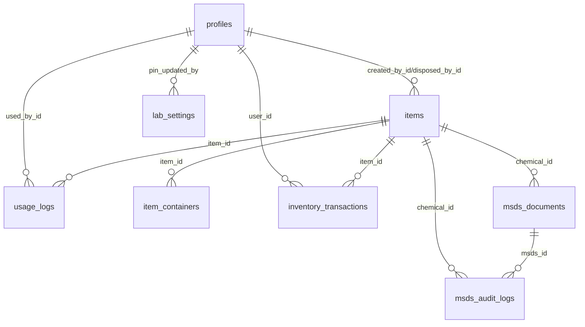

# Database Schema
[Back: Architecture](./04-Architecture.md) | [Next: Auth and Security](./06-Auth-and-Security.md)

Source of truth: `supabase/migrations/*.sql`.

## Tables (Public Schema)

## 1) `profiles`
Purpose: user profile and role metadata linked to `auth.users`.

| Column | Type | Notes |
|---|---|---|
| id | uuid | PK, FK to `auth.users.id` |
| email | text | unique |
| full_name | text | default `''` |
| role | text | check: `admin`/`super_admin` |
| is_active | boolean | default `true` |
| avatar_url | text | nullable |
| created_at | timestamptz | default utc now |
| updated_at | timestamptz | auto-updated via trigger |

Indexes: `idx_profiles_role`, `idx_profiles_is_active`.

## 2) `items`
Purpose: inventory master records for chemicals and consumables.

| Column | Type | Notes |
|---|---|---|
| id | uuid | PK |
| name | text | required |
| category | text | check: `chemical`/`consumable` |
| quantity | numeric | synced canonical quantity |
| unit | text | synced canonical unit |
| room_area / storage_type / storage_number / position / location | text | location metadata |
| project_fund_source | text | nullable |
| expiration_date | date | nullable |
| minimum_stock | numeric | default `0` |
| description | text | nullable |
| supplier | text | nullable |
| status | text | check: `active`/`archived`/`disposed` |
| date_received / lot_number / opened_date | date/text | nullable |
| disposed_at | timestamptz | nullable |
| disposed_reason | text | nullable |
| disposed_by_id | uuid | FK to `profiles.id` |
| created_by_id | uuid | FK to `profiles.id` |
| tracking_type | text | check: `SIMPLE_MEASURE`/`UNIT_ONLY`/`PACK_WITH_CONTENT` |
| quantity_value / quantity_unit | numeric/text | for simple measure |
| unit_type / total_units | text/int | for unit/pack |
| content_per_unit / content_label / total_content | int/text/int | pack content tracking |
| msds_current_id | uuid | FK to `msds_documents.id` (nullable) |
| created_at / updated_at | timestamptz | audit timestamps |

Key constraints:
- `items_tracking_type_check`
- `items_tracking_shape_check`
- `items_msds_current_id_fkey`

Key indexes:
- `idx_items_category`, `idx_items_status`, `idx_items_category_status`, `idx_items_name`, `idx_items_expiration_date`

## 3) `usage_logs`
Purpose: immutable-style stock action history for use/restock/adjust/dispose.

| Column | Type | Notes |
|---|---|---|
| id | uuid | PK |
| item_id | uuid | FK to `items.id`, `ON DELETE SET NULL` |
| item_name / item_type | text | snapshot fields |
| quantity_used | numeric | signed semantics by action |
| unit | text | unit snapshot |
| used_by_name | text | nullable |
| used_by_id | uuid | FK to `profiles.id` |
| notes | text | nullable |
| before_quantity / after_quantity | numeric | non-negative checks |
| action | text | check: `use/restock/adjust/dispose` |
| source | text | check: `scan/manual/student_mode` |
| idempotency_key | text | unique |
| student_id / experiment | text | optional student metadata |
| created_at / updated_at | timestamptz | timestamps |

Indexes:
- `idx_usage_logs_item_id`, `idx_usage_logs_action`, `idx_usage_logs_source`, `idx_usage_logs_created_at_desc`
- unique index `uq_usage_logs_idempotency_key`

## 4) `lab_settings`
Purpose: singleton table for lab-wide settings, including student PIN hash.

| Column | Type | Notes |
|---|---|---|
| id | uuid | PK |
| singleton | boolean | constrained to `true` |
| lab_name / lab_description / address / contact_email / contact_phone | text | lab metadata |
| lab_pin_hash | text | PIN hash |
| lab_pin_salt | text | currently used to store readable pin copy in current implementation |
| pin_expires_at | timestamptz | optional expiry |
| pin_updated_by | uuid | FK to `profiles.id` |
| created_at / updated_at | timestamptz | timestamps |

Index:
- unique partial index `uq_lab_settings_singleton_true` where `singleton=true`

## 5) `item_containers`
Purpose: sealed/opened container state for `PACK_WITH_CONTENT` items.

| Column | Type | Notes |
|---|---|---|
| id | uuid | PK |
| item_id | uuid | FK to `items.id` (`ON DELETE CASCADE`) |
| status | text | check: `SEALED` / `OPENED` |
| sealed_count | integer | used when status = SEALED |
| opened_content_remaining | integer | used when status = OPENED |
| created_at | timestamptz | timestamp |

Constraints:
- per-row status shape check
- unique sealed row per item: `uq_item_containers_sealed_per_item`

Indexes:
- `idx_item_containers_item_id`, `idx_item_containers_status`, `idx_item_containers_created_at`, `idx_item_containers_item_status_created`

## 6) `inventory_transactions`
Purpose: transaction ledger with deltas for compliance/reconstruction.

| Column | Type | Notes |
|---|---|---|
| id | uuid | PK |
| item_id | uuid | FK to `items.id` (`ON DELETE CASCADE`) |
| action | text | check: `ADD/USE_DEDUCT/RESTOCK/ADJUST/DISPOSE/ARCHIVE` |
| delta_measure | numeric | simple-measure changes |
| measure_unit | text | nullable |
| delta_units | integer | unit deltas |
| delta_content | integer | content deltas |
| notes | text | nullable |
| created_at | timestamptz | timestamp |
| user_id | uuid | FK to `profiles.id` |

Indexes:
- `idx_inventory_transactions_item_id`, `idx_inventory_transactions_action`, `idx_inventory_transactions_created_at_desc`

## 7) `msds_documents`
Purpose: versioned MSDS metadata per chemical (stored in `items` table).

| Column | Type | Notes |
|---|---|---|
| id | uuid | PK |
| chemical_id | uuid | FK to `items.id` (`ON DELETE CASCADE`) |
| version | integer | positive, unique per chemical |
| title / supplier | text | nullable metadata |
| revision_date | date | nullable |
| language | text | default `EN` |
| file_path | text | storage object path |
| file_name | text | nullable |
| file_size | bigint | nullable |
| file_hash | text | nullable |
| uploaded_by | uuid | FK to `auth.users.id` |
| uploaded_at | timestamptz | default utc now |
| is_active | boolean | default true |
| created_at / updated_at | timestamptz | timestamps |

Indexes/constraints:
- `idx_msds_documents_chemical_id`
- `uq_msds_documents_chemical_version`
- partial `idx_msds_documents_active` where `is_active=true`

## 8) `msds_audit_logs`
Purpose: MSDS operation audit trail.

| Column | Type | Notes |
|---|---|---|
| id | uuid | PK |
| chemical_id | uuid | FK to `items.id` (`ON DELETE SET NULL`) |
| msds_id | uuid | FK to `msds_documents.id` (`ON DELETE SET NULL`) |
| action | text | check: `UPLOAD/REPLACE/REMOVE/VIEW/DOWNLOAD` |
| actor_id | uuid | FK to `auth.users.id` |
| created_at | timestamptz | default utc now |
| meta | jsonb | default `{}` |

Indexes:
- `idx_msds_audit_logs_chemical`, `idx_msds_audit_logs_msds`, `idx_msds_audit_logs_actor`

## Relationship Map

## Storage Buckets and Object Policy Notes
- `avatars` bucket (public read, owner write/update/delete).
- `msds` bucket (private, PDF-only, 15MB limit; authenticated read + admin mutate policies).
