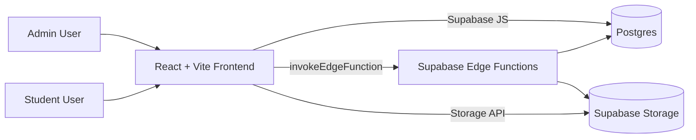
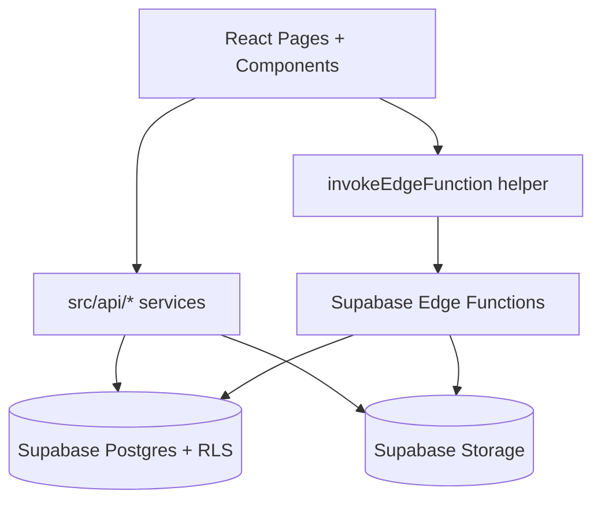
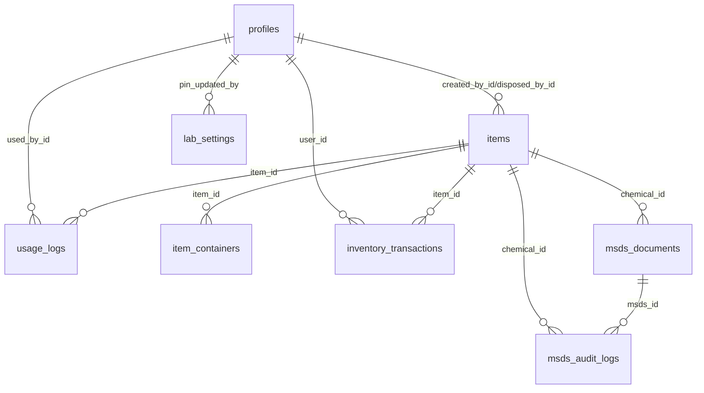

# Project Documentation (Consolidated)

This file is generated by combining all documents in /docs in numeric order.


---

## Source: 00-Overview.md

# GMBD MBB Lab Inventory: Overview
[Back to README](../README.md) | [Next: Features](./01-Features.md)

## Project Description
GMBD MBB Lab Inventory is a web-based laboratory inventory system for managing **Chemicals** and **Consumables**. It centralises stock records, usage transactions, storage location data, and audit-ready logs in one platform for the GMBD MBB laboratory context.

The system is designed for two major operating modes: **Admin mode** (full inventory management) and **Student mode** (PIN-gated, limited item usage recording). It uses Supabase for authentication, database, Row Level Security (RLS), and edge functions.

## Problem Statement
Manual tracking of laboratory supplies often causes delayed updates, unclear stock status, and incomplete usage records. This leads to stock-outs, over-ordering, and weak traceability during audits.

## Objectives
- Provide real-time inventory visibility for chemicals and consumables.
- Enforce role-based access for administrative and student workflows.
- Standardise usage, restock, adjust, archive, and dispose transactions.
- Preserve historical logs for operations and reporting.
- Support compliance-oriented documentation such as MSDS version history.

## Tech Stack
| Layer | Technology | Notes |
|---|---|---|
| Frontend | React 18 + Vite 6 | SPA with React Router |
| UI | Tailwind CSS + Radix UI + Lucide | Component-driven UI |
| Data/Backend | Supabase (Postgres + REST/RPC + Storage) | Main backend platform |
| Auth | Supabase Auth | Email/password + invite/set-password flow |
| Security | Supabase RLS + Storage Policies + Edge Functions | Role and PIN enforcement |
| Charts/Reports | Recharts | Dashboard/report visuals |
| Hosting | Vercel-ready config (`vercel.json`) | SPA rewrite to `/` |

## Main Modules / Screens
Based on `src/pages.config.js` and `src/pages/*`:
- Login
- Set Password
- Dashboard
- Chemicals
- Consumables
- Usage Logs
- Reports
- Settings
- Admin Management (visible for `super_admin`)
- Student Use
- About

## High-Level Diagram



---

## Source: 01-Features.md

# Features
[Back: Overview](./00-Overview.md) | [Next: User Roles and Permissions](./02-User-Roles-and-Permissions.md)

## Inventory Management
- Create, update, archive, restore, dispose, and permanently delete items.
- Separate modules for **Chemicals** and **Consumables**.
- Structured storage location fields: room, storage type, number, position.
- Multi-mode tracking:
  - `SIMPLE_MEASURE` (e.g., g, mL)
  - `UNIT_ONLY` (e.g., box, bottle)
  - `PACK_WITH_CONTENT` (e.g., packs with per-pack content)
- Low-stock threshold management (`minimum_stock`).
- Expiry date, lot/batch, supplier, project/fund source, and notes support.

## Stock Operations
- Use/Deduct
- Restock
- Adjust stock
- Dispose flow with reason/notes
- Automatic logs for stock-changing actions.

## Sealed/Opened Tracking
- For pack-based items:
  - Tracks sealed container count
  - Tracks opened containers and remaining content
  - Supports deduction by full units or by content

## Usage Logs and Auditing
- Usage logs page with filters, sorting, and pagination.
- Action types include use, restock, adjust, and dispose.
- Metadata includes before/after quantities, actor info, notes, and source.

## MSDS (Chemical Safety Document) Support
- Optional MSDS per chemical.
- Versioned MSDS records with current pointer.
- In-app view/download via short-lived signed URLs.
- MSDS history modal with set-current/archive actions.
- MSDS audit logs for upload, replace, remove, view, and download.

## User and Access Management
- Admin account login.
- Invite admin users by email.
- Set-password flow for invited users.
- Super Admin-only admin management page.

## Student Mode
- PIN-gated Student Use page.
- Search and select active items.
- Record usage without full admin login.
- PIN verification with brute-force protection in edge functions.

## Reports and Dashboard
- Dashboard cards and latest activity panels.
- Reports module for top-used, low-stock, expired/expiring items.
- CSV export support in inventory/report contexts.

## UX and Performance Features
- Debounced search on inventory and student pages.
- Loading skeletons and fetch indicators.
- Responsive layout with sidebar + mobile patterns.
- Client-side pagination UI for large tables.


---

## Source: 02-User-Roles-and-Permissions.md

# User Roles and Permissions
[Back: Features](./01-Features.md) | [Next: System Flow](./03-System-Flow.md)

## Roles Found in Codebase
From `profiles.role` constraints and UI checks:
- `super_admin`
- `admin`

Student access is implemented as a **PIN-based operational mode** (`/StudentUse`) and not as a persisted `profiles.role`.

`Staff` role: **Not found in codebase; may be planned.**

## Permissions Matrix
| Module / Action | Super Admin | Admin | Student (PIN mode) |
|---|---|---|---|
| View items | Yes | Yes | Limited (active items via edge function) |
| Create/Edit items | Yes | Yes | No |
| Archive/Restore/Dispose items | Yes | Yes | No |
| Delete item permanently | Yes (through UI flow) | Yes (current UI allows delete action) | No |
| Use/Restock/Adjust via admin dialogs | Yes | Yes | No |
| Record usage in Student mode | N/A | N/A | Yes |
| View usage logs | Yes | Yes | No |
| Update PIN settings | Yes | Yes | No |
| Invite users (basic invite-user function) | Function exists | Function exists | No |
| Invite admin (restricted invite-admin function) | Yes | No | No |
| Admin Management page | Yes | No |
| MSDS upload/replace/remove | Yes | Yes | No |
| MSDS view/download | Yes | Yes | Yes (active authenticated users; app flow focuses admin/student mode) |
| View MSDS audit logs | Yes | Yes (policy allows select for admin/super_admin) | No |

## How Permissions Are Enforced
## Frontend Enforcement
- `Layout.jsx` shows/hides pages based on session and role checks.
- `AdminManagement` nav entry appears only for `super_admin`.
- Student mode is isolated in `StudentUse` page and uses PIN verification.
- MSDS management buttons are shown only for admin/super_admin profiles.

## Backend Enforcement (Primary)
- Supabase RLS policies restrict table access (`items`, `usage_logs`, `profiles`, `lab_settings`, `item_containers`, `inventory_transactions`, `msds_documents`, `msds_audit_logs`).
- Supabase edge functions check:
  - User JWT validity where required.
  - Role (`admin` / `super_admin`) for protected operations.
  - PIN validity for student usage flow.

## Notes
- Security-critical rules should always be treated as backend-owned (RLS + edge function checks), not frontend-only.

---

## Source: 03-System-Flow.md

# System Flow
[Back: Roles and Permissions](./02-User-Roles-and-Permissions.md) | [Next: Architecture](./04-Architecture.md)

## 1) Admin Login to Inventory Operations
1. Admin opens Login page and signs in using email + password.
2. App checks Supabase session and loads profile.
3. Admin navigates to Dashboard/Chemicals/Consumables.
4. Admin adds a new item using `ItemForm`.
5. Stock lifecycle actions are performed through dialogs:
   - Use/Deduct
   - Restock
   - Adjust
   - Dispose
6. Each action updates stock via RPC/database calls and writes usage logs/transactions.
7. Changes are reflected in inventory tables, usage logs, and reports.

## 2) Invite Admin User to Set Password
1. Super Admin opens Admin Management.
2. Super Admin submits invite email.
3. `invite-admin` edge function validates requester role (`super_admin` only).
4. Supabase sends invite link to email.
5. Invitee opens `/set-password`.
6. Invitee sets password (minimum 8 characters).
7. Account metadata is updated with `password_set: true`.

## 3) Student PIN Journey
1. Student opens `/StudentUse`.
2. Student enters lab PIN.
3. `verify-pin` edge function validates PIN and brute-force limits.
4. If valid, session-like local state is created (temporary local session).
5. Student searches active items via `student-items` edge function.
6. Student selects item and records usage.
7. `student-use-item` validates PIN again and executes stock deduction logic.
8. Usage result is returned and reflected in subsequent queries.

## 4) MSDS Journey (Chemical)
1. Admin opens Chemicals page.
2. Admin uploads or replaces MSDS (PDF) for a chemical.
3. System creates new `msds_documents` version.
4. PDF is uploaded to private `msds` bucket path.
5. Chemical `msds_current_id` is updated to newest version.
6. Audit log entry is stored (`UPLOAD` or `REPLACE`).
7. View/Download requests call `msds-signed-url` edge function, which:
   - validates user and role/access
   - generates short-lived signed URL
   - logs `VIEW` or `DOWNLOAD`

## Sequence Snapshot (Admin Deduct)
```text
Admin UI -> Supabase RPC (use_deduct_item / rpc_safe_use_item)
        -> DB row lock on item
        -> quantity/container updates
        -> usage_logs + inventory_transactions inserts
        -> response to UI
```


---

## Source: 04-Architecture.md

# Architecture
[Back: System Flow](./03-System-Flow.md) | [Next: Database Schema](./05-Database-Schema.md)

## Folder Structure (Key Parts)
```text
src/
  api/                 # Data access service modules
  components/          # UI and feature components
    inventory/         # Inventory-specific components/dialogs
    ui/                # Reusable UI primitives
  hooks/               # Custom hooks (e.g., debounce)
  lib/                 # Auth context, Supabase client, edge client
  pages/               # Route-level pages/screens
  types/               # Type definitions (e.g., MSDS)
  App.jsx              # Router + providers
  Layout.jsx           # Protected app shell + nav

supabase/
  migrations/          # SQL migrations (schema, RLS, policies, functions)
  functions/           # Edge functions (Deno)
```

## Application Pattern
- React SPA using route-per-page pattern (`pages.config.js` + `App.jsx`).
- Feature modules live under `components/inventory` and `src/api`.
- Supabase is used directly in frontend data clients and via edge functions for sensitive flows.

## State Management
- Primary state management: `useState`, `useEffect`, `useMemo`, `useCallback`.
- Global auth state: `AuthContext`.
- React Query provider exists (`QueryClientProvider`), but most feature pages use direct state + manual fetch patterns.

## Data Fetching Pattern
- Frontend data clients:
  - `itemsDataClient.js`
  - `usageLogsDataClient.js`
  - `profilesDataClient.js`
  - `msdsService.ts`
- Sensitive/public operations via edge functions using `invokeEdgeFunction`.
- Sorting/filtering mostly client-side after fetch.

## Error Handling and Logging
- UI notifications through `sonner` toasts.
- `try/catch` in page handlers and service calls.
- Console logging for developer diagnostics in frontend and edge functions.
- Edge functions return structured HTTP errors with JSON payloads.

## Performance and UX Optimisations Observed
- Debounced search (`useDebounce`, lodash debounce in student mode).
- Loading skeleton placeholders in tables and cards.
- Client-side pagination for major tables.
- Lightweight page transitions and progressive fetch indicators.
- Server-side row locking in RPC functions for stock consistency.

## High-Level Runtime Diagram



---

## Source: 05-Database-Schema.md

# Database Schema
[Back: Architecture](./04-Architecture.md) | [Next: Auth and Security](./06-Auth-and-Security.md)

Source of truth: `supabase/migrations/*.sql`.

## Tables (Public Schema)

## 1) `profiles`
Purpose: user profile and role metadata linked to `auth.users`.

| Column | Type | Notes |
|---|---|---|
| id | uuid | PK, FK to `auth.users.id` |
| email | text | unique |
| full_name | text | default `''` |
| role | text | check: `admin`/`super_admin` |
| is_active | boolean | default `true` |
| avatar_url | text | nullable |
| created_at | timestamptz | default utc now |
| updated_at | timestamptz | auto-updated via trigger |

Indexes: `idx_profiles_role`, `idx_profiles_is_active`.

## 2) `items`
Purpose: inventory master records for chemicals and consumables.

| Column | Type | Notes |
|---|---|---|
| id | uuid | PK |
| name | text | required |
| category | text | check: `chemical`/`consumable` |
| quantity | numeric | synced canonical quantity |
| unit | text | synced canonical unit |
| room_area / storage_type / storage_number / position / location | text | location metadata |
| project_fund_source | text | nullable |
| expiration_date | date | nullable |
| minimum_stock | numeric | default `0` |
| qr_code_value | text | nullable |
| description | text | nullable |
| supplier | text | nullable |
| status | text | check: `active`/`archived`/`disposed` |
| date_received / lot_number / opened_date | date/text | nullable |
| disposed_at | timestamptz | nullable |
| disposed_reason | text | nullable |
| disposed_by_id | uuid | FK to `profiles.id` |
| created_by_id | uuid | FK to `profiles.id` |
| tracking_type | text | check: `SIMPLE_MEASURE`/`UNIT_ONLY`/`PACK_WITH_CONTENT` |
| quantity_value / quantity_unit | numeric/text | for simple measure |
| unit_type / total_units | text/int | for unit/pack |
| content_per_unit / content_label / total_content | int/text/int | pack content tracking |
| msds_current_id | uuid | FK to `msds_documents.id` (nullable) |
| created_at / updated_at | timestamptz | audit timestamps |

Key constraints:
- `items_tracking_type_check`
- `items_tracking_shape_check`
- `items_msds_current_id_fkey`

Key indexes:
- `idx_items_category`, `idx_items_status`, `idx_items_category_status`, `idx_items_name`, `idx_items_expiration_date`

## 3) `usage_logs`
Purpose: immutable-style stock action history for use/restock/adjust/dispose.

| Column | Type | Notes |
|---|---|---|
| id | uuid | PK |
| item_id | uuid | FK to `items.id`, `ON DELETE SET NULL` |
| item_name / item_type | text | snapshot fields |
| quantity_used | numeric | signed semantics by action |
| unit | text | unit snapshot |
| used_by_name | text | nullable |
| used_by_id | uuid | FK to `profiles.id` |
| notes | text | nullable |
| before_quantity / after_quantity | numeric | non-negative checks |
| action | text | check: `use/restock/adjust/dispose` |
| source | text | check: `scan/manual/student_mode` |
| idempotency_key | text | unique |
| student_id / experiment | text | optional student metadata |
| created_at / updated_at | timestamptz | timestamps |

Indexes:
- `idx_usage_logs_item_id`, `idx_usage_logs_action`, `idx_usage_logs_source`, `idx_usage_logs_created_at_desc`
- unique index `uq_usage_logs_idempotency_key`

## 4) `lab_settings`
Purpose: singleton table for lab-wide settings, including student PIN hash.

| Column | Type | Notes |
|---|---|---|
| id | uuid | PK |
| singleton | boolean | constrained to `true` |
| lab_name / lab_description / address / contact_email / contact_phone | text | lab metadata |
| lab_pin_hash | text | PIN hash |
| lab_pin_salt | text | currently used to store readable pin copy in current implementation |
| pin_expires_at | timestamptz | optional expiry |
| pin_updated_by | uuid | FK to `profiles.id` |
| created_at / updated_at | timestamptz | timestamps |

Index:
- unique partial index `uq_lab_settings_singleton_true` where `singleton=true`

## 5) `item_containers`
Purpose: sealed/opened container state for `PACK_WITH_CONTENT` items.

| Column | Type | Notes |
|---|---|---|
| id | uuid | PK |
| item_id | uuid | FK to `items.id` (`ON DELETE CASCADE`) |
| status | text | check: `SEALED` / `OPENED` |
| sealed_count | integer | used when status = SEALED |
| opened_content_remaining | integer | used when status = OPENED |
| created_at | timestamptz | timestamp |

Constraints:
- per-row status shape check
- unique sealed row per item: `uq_item_containers_sealed_per_item`

Indexes:
- `idx_item_containers_item_id`, `idx_item_containers_status`, `idx_item_containers_created_at`, `idx_item_containers_item_status_created`

## 6) `inventory_transactions`
Purpose: transaction ledger with deltas for compliance/reconstruction.

| Column | Type | Notes |
|---|---|---|
| id | uuid | PK |
| item_id | uuid | FK to `items.id` (`ON DELETE CASCADE`) |
| action | text | check: `ADD/USE_DEDUCT/RESTOCK/ADJUST/DISPOSE/ARCHIVE` |
| delta_measure | numeric | simple-measure changes |
| measure_unit | text | nullable |
| delta_units | integer | unit deltas |
| delta_content | integer | content deltas |
| notes | text | nullable |
| created_at | timestamptz | timestamp |
| user_id | uuid | FK to `profiles.id` |

Indexes:
- `idx_inventory_transactions_item_id`, `idx_inventory_transactions_action`, `idx_inventory_transactions_created_at_desc`

## 7) `msds_documents`
Purpose: versioned MSDS metadata per chemical (stored in `items` table).

| Column | Type | Notes |
|---|---|---|
| id | uuid | PK |
| chemical_id | uuid | FK to `items.id` (`ON DELETE CASCADE`) |
| version | integer | positive, unique per chemical |
| title / supplier | text | nullable metadata |
| revision_date | date | nullable |
| language | text | default `EN` |
| file_path | text | storage object path |
| file_name | text | nullable |
| file_size | bigint | nullable |
| file_hash | text | nullable |
| uploaded_by | uuid | FK to `auth.users.id` |
| uploaded_at | timestamptz | default utc now |
| is_active | boolean | default true |
| created_at / updated_at | timestamptz | timestamps |

Indexes/constraints:
- `idx_msds_documents_chemical_id`
- `uq_msds_documents_chemical_version`
- partial `idx_msds_documents_active` where `is_active=true`

## 8) `msds_audit_logs`
Purpose: MSDS operation audit trail.

| Column | Type | Notes |
|---|---|---|
| id | uuid | PK |
| chemical_id | uuid | FK to `items.id` (`ON DELETE SET NULL`) |
| msds_id | uuid | FK to `msds_documents.id` (`ON DELETE SET NULL`) |
| action | text | check: `UPLOAD/REPLACE/REMOVE/VIEW/DOWNLOAD` |
| actor_id | uuid | FK to `auth.users.id` |
| created_at | timestamptz | default utc now |
| meta | jsonb | default `{}` |

Indexes:
- `idx_msds_audit_logs_chemical`, `idx_msds_audit_logs_msds`, `idx_msds_audit_logs_actor`

## Relationship Map


## Storage Buckets and Object Policy Notes
- `avatars` bucket (public read, owner write/update/delete).
- `msds` bucket (private, PDF-only, 15MB limit; authenticated read + admin mutate policies).


---

## Source: 06-Auth-and-Security.md

# Auth and Security
[Back: Database Schema](./05-Database-Schema.md) | [Next: API and Data Access](./07-API-and-Data-Access.md)

## Authentication Flow
- Primary auth uses **Supabase Auth**.
- Admin users sign in through `supabase.auth.signInWithPassword`.
- Invite + password setup flow:
  - invite functions send email invite links
  - invited users complete `/set-password`
- Session handling:
  - `AuthContext` checks current session
  - layout redirects unauthenticated users from protected pages

Student mode is separate:
- Students use a **Lab PIN** via edge functions (`verify-pin`, `student-use-item`) rather than normal admin session login.

## Password Rules
- `SetPassword` enforces minimum length of **8 characters**.
- `Settings` password update also enforces minimum 8 characters.

## RLS Overview
RLS is enabled on key tables:
- `profiles`
- `items`
- `usage_logs`
- `lab_settings`
- `item_containers`
- `inventory_transactions`
- `msds_documents`
- `msds_audit_logs`

Policy patterns:
- active authenticated users can read operational tables.
- admin/super_admin can mutate inventory and MSDS-related tables.
- super_admin has elevated actions in selected areas (e.g., admin management operations, some log mutation policies).

## Storage Security
- `avatars` bucket:
  - public read
  - user-owned write/update/delete based on folder path and `auth.uid()`
- `msds` bucket:
  - private
  - authenticated read
  - admin-only write/update/delete
  - MIME/type and size limits configured in migration

## Edge Function Security
- Functions use `SUPABASE_SERVICE_ROLE_KEY` server-side only.
- Protected functions parse and validate bearer JWTs.
- Role checks are performed against `profiles` where required.
- Student PIN functions implement brute-force throttling and delayed failure responses.

## Security Checklist (Current + Recommended)
## Implemented
- RLS on business tables.
- Role checks in edge functions.
- Signed URLs for private MSDS file access.
- PIN hashing (`bcrypt`) for verification.
- Idempotency support in stock operations (`usage_logs.idempotency_key`).

## Recommended hardening
- Remove plaintext-equivalent PIN persistence (`lab_pin_salt/current_pin` exposure path in current code).
- Restrict CORS origins from `*` to known frontend domains for production.
- Add centralised security logging and alerting for repeated PIN failures.
- Rotate service-role secrets and enforce strict secret management.

## Threat Notes
- SQL Injection: low risk in current query-builder/RPC usage (no raw SQL from untrusted input in frontend).
- XSS: React rendering protects by default; still validate/escape any future raw HTML features.
- Auth leakage: avoid exposing tokens in logs or local storage beyond intended scope.
- Insecure file access: mitigated by private bucket + short-lived signed URLs.


---

## Source: 07-API-and-Data-Access.md

# API and Data Access
[Back: Auth and Security](./06-Auth-and-Security.md) | [Next: Inventory Logic](./08-Inventory-Logic.md)

## Data Access Layers
## Frontend service modules
- `src/api/itemsDataClient.js`
- `src/api/usageLogsDataClient.js`
- `src/api/profilesDataClient.js`
- `src/api/msdsService.ts`

## Edge function caller
- `src/lib/edgeClient.js` (`invokeEdgeFunction`)
- Adds `apikey`, optional bearer token, and JSON payload.

## Edge Functions (`supabase/functions/*`)

## `verify-pin`
- Purpose: validate student Lab PIN.
- Input JSON:
```json
{ "pin": "123456" }
```
- Output (success):
```json
{ "valid": true, "expires_at": null }
```
- Used by: `src/pages/StudentUse.jsx`.

## `student-use-item`
- Purpose: record student usage with PIN validation.
- Input JSON:
```json
{
  "pin": "123456",
  "item_id": "uuid",
  "quantity": 1,
  "deduct_mode": "CONTENT",
  "student_name": "Juan Dela Cruz",
  "student_id": "2026-001",
  "experiment": "PCR Lab",
  "notes": "Optional"
}
```
- Output (success):
```json
{ "success": true, "idempotency_key": "key", "result": { } }
```
- Used by: `src/pages/StudentUse.jsx`.

## `student-items`
- Purpose: return active items for student mode (with pack stats).
- Input JSON:
```json
{ "query": "ethanol", "item_id": "optional-uuid" }
```
- Output:
```json
{ "items": [ ... ] }
```
- Used by: `src/pages/StudentUse.jsx`.

## `get-lab-settings`
- Purpose: load PIN settings for authorised admins.
- Input JSON: `{}`.
- Output:
```json
{
  "settings": {
    "id": "uuid",
    "pin_expires_at": null,
    "pin_updated_by": "uuid",
    "updated_at": "...",
    "has_pin": true,
    "current_pin": "******"
  }
}
```
- Used by: `src/pages/Settings.jsx`.

## `set-lab-pin`
- Purpose: update lab PIN and expiry.
- Input JSON:
```json
{
  "pin": "123456",
  "pin_expires_at": "2026-12-31T23:59:59.000Z",
  "pin_updated_by": "uuid"
}
```
- Output:
```json
{ "success": true, "settings": { ... } }
```
- Used by: `src/pages/Settings.jsx`.

## `invite-admin`
- Purpose: super-admin invite flow for admin users.
- Input JSON: `{ "email": "name@example.com" }`
- Output: `{ "success": true, "message": "Invitation sent successfully" }`
- Used by: `src/pages/AdminManagement.jsx`.

## `invite-user`
- Purpose: generic invite function (present in repo).
- Input JSON: `{ "email": "name@example.com" }`
- Output: `{ "success": true, "user": { ... } }`
- Frontend call: **Not found in current pages; may be planned/legacy.**

## `msds-signed-url`
- Purpose: create short-lived signed URL for MSDS view/download and log audit action.
- Input JSON:
```json
{ "msds_id": "uuid", "mode": "view" }
```
- Output:
```json
{
  "msds_id": "uuid",
  "mode": "view",
  "signed_url": "https://...",
  "expires_in": 180
}
```
- Used by: `src/api/msdsService.ts` in Chemicals MSDS actions.

## RPC Functions Used
- `rpc_safe_use_item`
- `rpc_restock_item`
- `rpc_adjust_item_stock`
- `rpc_dispose_item`
- `use_deduct_item` (tracking-aware deduct for current model)

Invoked from:
- `src/components/inventory/inventoryHelpers.jsx`

## Data Contracts (Key Objects)

## `Item`
Key fields:
- identity: `id`, `name`, `category`
- stock canonical: `quantity`, `unit`
- tracking: `tracking_type`, `quantity_value`, `quantity_unit`, `unit_type`, `total_units`, `content_per_unit`, `content_label`, `total_content`
- location: `room_area`, `storage_type`, `storage_number`, `position`
- state: `status`, `minimum_stock`, `expiration_date`, `opened_date`
- compliance: `lot_number`, `supplier`, `project_fund_source`
- MSDS: `msds_current_id`, `msds_current`

## `UsageLog`
Key fields:
- `id`, `item_id`, `item_name`, `item_type`
- `action`, `quantity_used`, `unit`
- `before_quantity`, `after_quantity`
- `used_by_name`, `used_by_id`
- `source`, `notes`, `created_at`

## `Profile`
Key fields:
- `id`, `email`, `full_name`
- `role`, `is_active`
- `avatar_url`

## `StockLot/Batch` Equivalent (`item_containers`)
Key fields:
- `id`, `item_id`
- `status` (`SEALED` / `OPENED`)
- `sealed_count`
- `opened_content_remaining`
- `created_at`

## `Transaction` (`inventory_transactions`)
Key fields:
- `id`, `item_id`, `action`
- `delta_measure`, `measure_unit`
- `delta_units`, `delta_content`
- `notes`, `user_id`, `created_at`

## `MSDSDocument`
Key fields:
- `id`, `chemical_id`, `version`
- `title`, `supplier`, `revision_date`, `language`
- `file_path`, `file_name`, `file_size`, `file_hash`
- `uploaded_by`, `uploaded_at`, `is_active`

---

## Source: 08-Inventory-Logic.md

# Inventory Logic
[Back: API and Data Access](./07-API-and-Data-Access.md) | [Next: Deployment](./09-Deployment.md)

This section documents the actual stock logic implemented in migrations, RPCs, and frontend helpers.

## Item Categories
- `chemical`
- `consumable`

Both categories use the same `items` table and tracking model.

## Tracking Types
## 1) `SIMPLE_MEASURE`
- Example units: `g`, `mg`, `mL`, `L`.
- Main fields: `quantity_value`, `quantity_unit`.
- `quantity`/`unit` are synchronised for compatibility.

## 2) `UNIT_ONLY`
- Example units: `box`, `pack`, `bag`, `bottle`.
- Main fields: `total_units`, `unit_type`.
- Requires whole-number unit operations.

## 3) `PACK_WITH_CONTENT`
- Supports “container with content” scenarios (e.g., **12 bags x 100 pcs**).
- Main fields:
  - `total_units` (number of containers)
  - `content_per_unit` (content per container)
  - `content_label` (e.g., pcs, tubes)
  - `total_content` (aggregate usable content)
- Container state is persisted in `item_containers`:
  - one `SEALED` row with `sealed_count`
  - zero or more `OPENED` rows with `opened_content_remaining`

## Per-Bag / Per-Container Concept
Example:
- `total_units = 12` bags
- `content_per_unit = 100` pcs
- `total_content = 1200` pcs

If user deducts by content, the system may open a sealed bag and convert part of stock to opened state.

## Deduct Logic
Implemented mainly in `use_deduct_item` RPC.

## For `SIMPLE_MEASURE`
- Deducts numeric amount from `quantity_value`.
- Prevents negative stock.
- Updates usage logs and inventory transactions.

## For `UNIT_ONLY`
- Deduct amount must be integer.
- Deducts from `total_units`.
- Prevents negative stock.

## For `PACK_WITH_CONTENT`
Two modes:
- `UNITS`: deduct full sealed packs only.
- `CONTENT`: deduct partial/full content units.

### `CONTENT` mode behaviour
- Consume from existing opened containers first.
- If insufficient, open a sealed container (decrement sealed count).
- Track remaining content in opened container rows.
- If opened container reaches zero, it is removed and unit counters are adjusted.
- Prevents overspending beyond `total_content`.

## Status Handling
Item-level status:
- `active`
- `archived`
- `disposed`

Additional operational flags:
- `opened_date` for non-pack items (set on first manual use when previously unopened).
- Pack state handled via `item_containers` (sealed/opened split).

`empty` status flag: **Not found as a dedicated status value in codebase**. Zero stock is inferred from quantity values.

## Expiry and FEFO/FIFO
- Expiry date is stored and used for filtering, warnings, and badges.
- FEFO/FIFO consumption ordering by expiry/batch:
  - **Not found as an explicit deduct algorithm in current RPCs**.
  - Pack `CONTENT` mode processes opened containers by creation order.

## Negative Stock Prevention
- All deduct RPC paths validate available stock before update.
- DB check constraints enforce non-negative and shape-valid values for core fields.

## Edge Cases Covered
- Reject non-integer unit deductions in `UNIT_ONLY` and pack unit mode.
- Reject invalid `deduct_mode`.
- Reject use of `archived` or `disposed` items.
- Support items without expiry dates.
- Validate pack items must have positive `content_per_unit`.

## Worked Examples
## Example A: Unit-only
- Item: gloves box (`UNIT_ONLY`)
- `total_units = 10`
- Deduct `3` units
- Result: `total_units = 7`

## Example B: Pack with content
- Item: microtubes (`PACK_WITH_CONTENT`)
- `sealed_count = 5`, opened rows: one row with `20 pcs remaining`
- `content_per_unit = 100`
- Deduct `40 pcs` in `CONTENT` mode:
  - consume 20 from opened row (row emptied, removed)
  - open 1 sealed pack (sealed becomes 4)
  - consume 20 from newly opened pack (80 remains opened)
  - total content decreases by 40


---

## Source: 09-Deployment.md

# Deployment Guide
[Back: Inventory Logic](./08-Inventory-Logic.md) | [Next: Troubleshooting](./10-Troubleshooting.md)

## Environment Variables
## Frontend (`.env`)
- `VITE_SUPABASE_URL`
- `VITE_SUPABASE_ANON_KEY`
- `VITE_USE_SUPABASE_MUTATIONS` (feature flag)
- `VITE_BYPASS_AUTH` (dev bypass switch)
- `VITE_USE_SUPABASE_ITEMS`
- `VITE_USE_SUPABASE_LOGS`
- `VITE_USE_SUPABASE_PROFILES`

## Edge Functions (Supabase secrets)
- `SUPABASE_URL`
- `SUPABASE_SERVICE_ROLE_KEY`
- `BASE_URL` / `VITE_BASE_URL` (required by invite-admin redirect flow)

## Local Build Commands
```bash
npm install
npm run build
npm run preview
```

## Supabase Setup
1. Create/open Supabase project.
2. Configure secrets for edge functions.
3. Apply DB migrations:
```bash
supabase db push
```
4. Deploy edge functions:
```bash
supabase functions deploy verify-pin
supabase functions deploy student-items
supabase functions deploy student-use-item
supabase functions deploy get-lab-settings
supabase functions deploy set-lab-pin
supabase functions deploy invite-admin
supabase functions deploy invite-user
supabase functions deploy msds-signed-url
```

## RLS Enablement
RLS and policies are migration-driven. After migration:
- verify tables have RLS enabled in Supabase dashboard.
- verify policies exist for app-critical tables and storage objects.

## Hosting Notes
Current repo includes `vercel.json` with SPA rewrite:
```json
{ "rewrites": [{ "source": "/(.*)", "destination": "/" }] }
```
This supports direct URL reloads for React Router routes.

## Suggested Production Flow
1. Push code to main branch.
2. Build validation (`npm run build`, `npm run lint`).
3. Deploy frontend (Vercel/other static host).
4. Apply migrations to production Supabase.
5. Deploy/update edge functions.
6. Run smoke tests: login, dashboard load, stock operations, student PIN, MSDS view/download.

## Post-Deploy Checklist
- [ ] Frontend env vars correct.
- [ ] Supabase URL and anon key correct.
- [ ] Service role secret set in edge functions.
- [ ] All edge functions deployed and reachable.
- [ ] RLS policies active.
- [ ] Student PIN can be validated.
- [ ] Admin invite flow works.
- [ ] MSDS signed URL flow works.


---

## Source: 10-Troubleshooting.md

# Troubleshooting
[Back: Deployment](./09-Deployment.md) | [Next: Contributing and Dev Setup](./11-Contributing-and-Dev-Setup.md)

## Common Errors

## 401 Unauthorized (Edge Functions)
Possible causes:
- Missing `Authorization: Bearer <access_token>` for protected functions.
- Expired/invalid token.
- Missing `apikey` header in edge calls.

Checks:
- Inspect `src/lib/edgeClient.js` request headers.
- Verify user session in browser devtools and Supabase Auth state.
- Review edge function logs in Supabase dashboard.

## 403 Forbidden
Possible causes:
- User role is not allowed (`admin/super_admin` checks fail).
- `profiles.is_active` is false.
- RLS policy denies operation.

Checks:
- Confirm `profiles` record role and active status.
- Re-check table policies in SQL editor / dashboard.

## 406 / Query Response Errors
Possible causes:
- `.single()` used where row not found.
- select shape mismatch after schema changes.

Checks:
- Validate selected columns in `src/api/*.js`.
- Use `.maybeSingle()` where optional row is expected.

## CORS Errors
Possible causes:
- Function CORS headers mismatch with request method/headers.
- Browser preflight blocked.

Checks:
- Confirm function returns `OPTIONS` with CORS headers.
- Verify request includes allowed headers only.

## Missing Environment Variables
Symptoms:
- App fails on startup (`Missing VITE_SUPABASE_URL...`).
- Edge functions throw missing secret errors.

Checks:
- Verify `.env` keys for frontend.
- Verify Supabase edge function secrets are set.

## Dashboard/Data Fetch Fails
Checklist:
1. Confirm login/session is valid.
2. Confirm `profiles` row exists for logged-in user.
3. Confirm RLS select policies permit current role.
4. Check network tab for failed endpoint/query.
5. Check Supabase logs (database and edge functions).

## Student Mode Issues
Symptoms:
- PIN rejected repeatedly.
- `Too many failed PIN attempts`.

Checks:
- Confirm PIN is set in settings.
- Validate pin expiry (`pin_expires_at`).
- Wait for brute-force lock window to expire (edge function rate control).

## MSDS Issues
Symptoms:
- Cannot upload MSDS.
- View/Download fails.

Checks:
- Ensure file is PDF and <=15MB.
- Verify `msds` bucket exists and is private.
- Verify storage policies for read/write.
- Verify `msds-signed-url` function is deployed and logs no errors.

## Where to Look in Code
- Auth/session handling: `src/lib/AuthContext.jsx`, `src/Layout.jsx`
- Inventory data access: `src/api/itemsDataClient.js`
- Stock RPC orchestration: `src/components/inventory/inventoryHelpers.jsx`
- Student flows: `src/pages/StudentUse.jsx`
- Edge invoker: `src/lib/edgeClient.js`
- Edge functions: `supabase/functions/*`
- RLS + schema: `supabase/migrations/*`


---

## Source: 11-Contributing-and-Dev-Setup.md

# Contributing and Dev Setup
[Back: Troubleshooting](./10-Troubleshooting.md) | [Back to README](../README.md)

## Prerequisites
- Node.js (recommended: 18+)
- npm
- Supabase project access (for database and edge function work)

## Local Setup
```bash
npm install
npm run dev
```

## Useful Scripts
```bash
npm run dev
npm run build
npm run preview
npm run lint
npm run lint:fix
npm run typecheck
npm run test:unit
npm run test:integration
npm test
```

## Suggested Branching Strategy
- `main`: deployable branch
- `feature/<short-name>`: feature work
- `fix/<short-name>`: bug fixes
- `docs/<short-name>`: documentation updates

## Commit Convention (Recommended)
- `feat: ...`
- `fix: ...`
- `docs: ...`
- `refactor: ...`
- `chore: ...`

Example:
```text
feat: add msds history modal actions
```

## Development Patterns in This Repo
- Add route pages in `src/pages/` (auto-registered in `pages.config.js` generation flow).
- Keep business/data access inside `src/api/*`.
- Reuse shared UI primitives in `src/components/ui`.
- Keep feature-specific UI under `src/components/<feature>`.
- Prefer backend-enforced permissions (RLS + edge checks), then reflect in UI.

## How to Add a New Module/Page
1. Create page under `src/pages`.
2. Ensure route is available via `pages.config.js` process.
3. Add menu entry in `Layout.jsx` if needed.
4. Create service module under `src/api` for data access.
5. Add/adjust migration if schema changes are needed.
6. Add edge function if server-side privileged access is required.
7. Validate with `lint` + `build`.

## Testing Status
- Automated test suite is configured with **Vitest**.
- Unit tests: `npm run test:unit`
- Integration tests: `npm run test:integration`
- Combined run: `npm test`

Latest recorded run (February 25, 2026):
- `test:unit`: 8 passed
- `test:integration`: 3 passed
- `typecheck`: passed
- `lint`: passed

## Code Review Checklist (Practical)
- [ ] No direct role trust in frontend-only checks for critical actions.
- [ ] RLS and policy impact reviewed for schema changes.
- [ ] Edge functions validate auth and inputs.
- [ ] Inventory calculations do not allow negative stock.
- [ ] UI loading/error states are covered.
- [ ] Build and lint pass locally.
